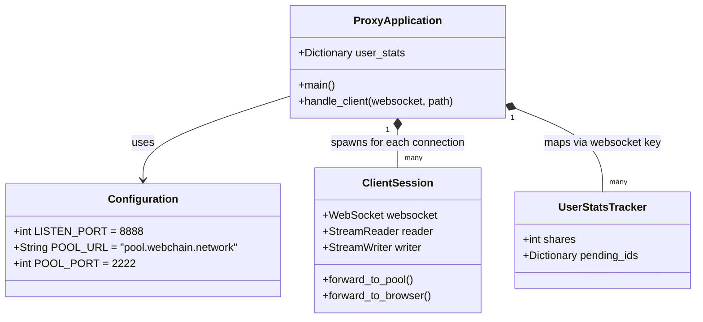
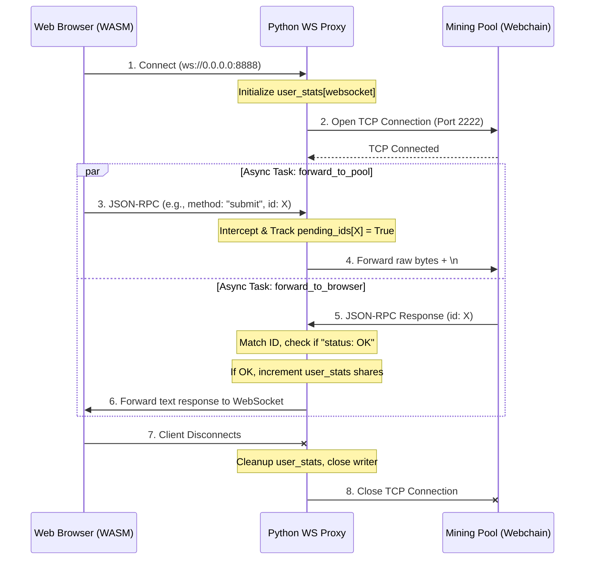
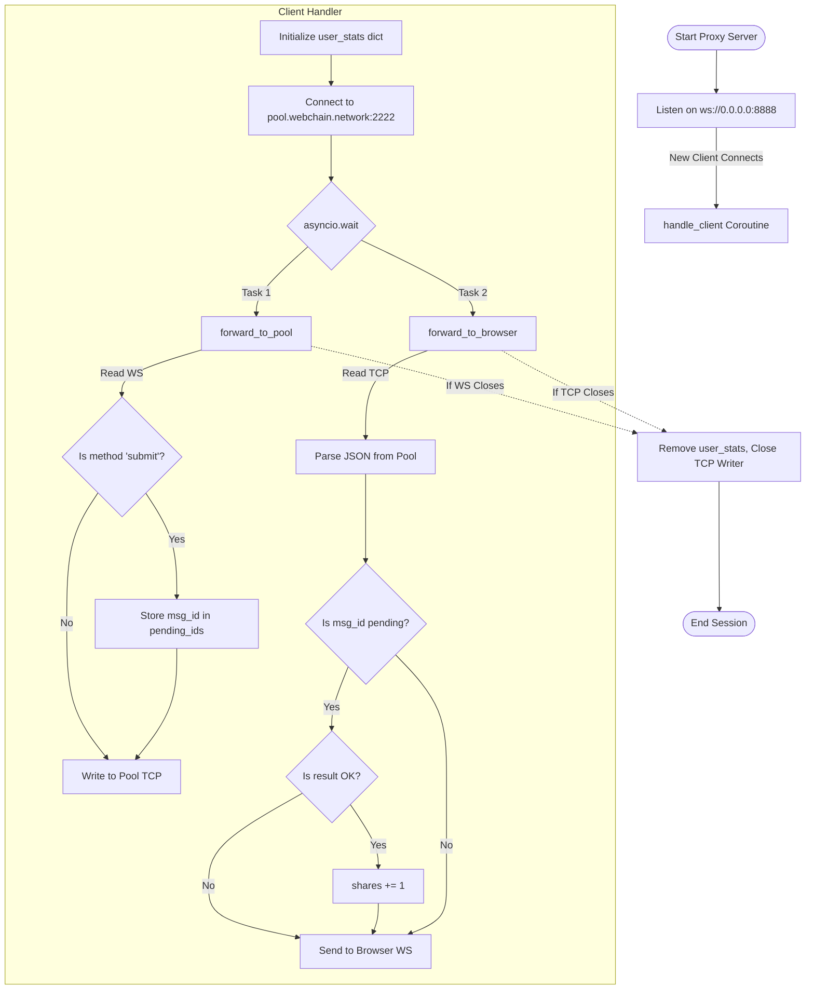

# Python

For Python (.py) format:

```python
python file.py
```

or

```python
python3 file.py
```

# NodeJs

For Javascript file format:

```js
node file.js
```

# Diagrams Explaining Codes

## mintme/smart_proxy.py

### Class Diagram



### Sequence Diagram



### Architecture & Task Flowchart


