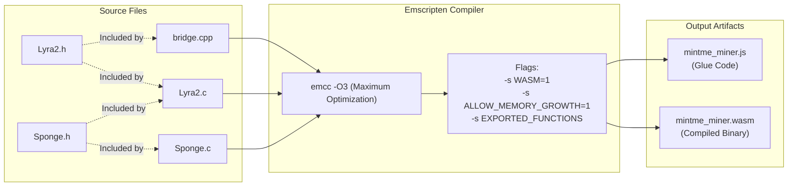
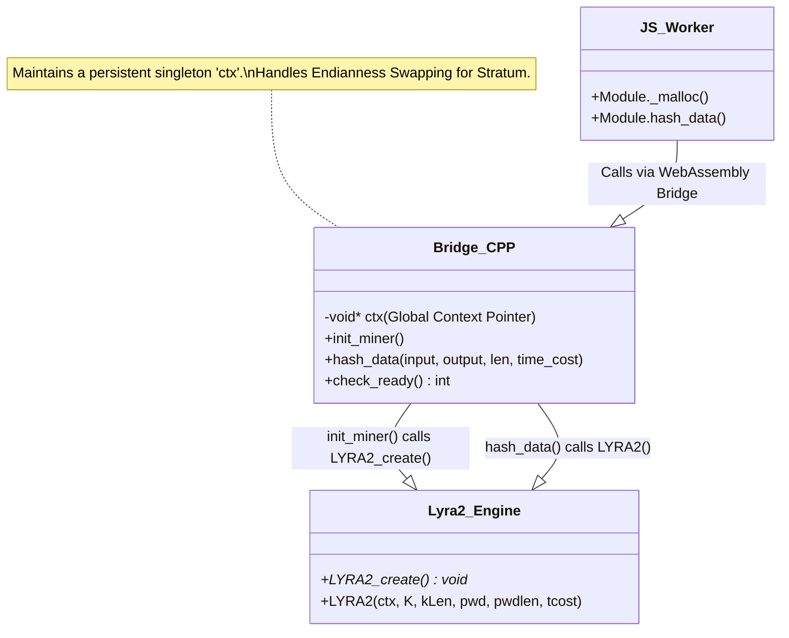
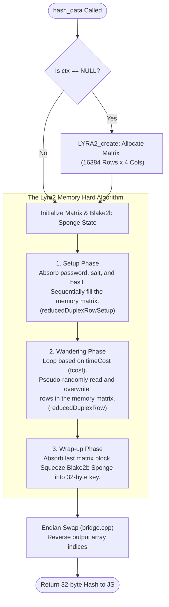
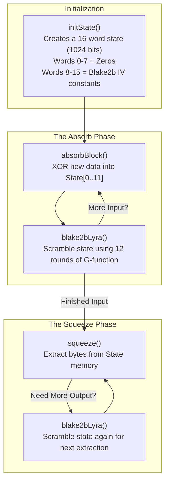
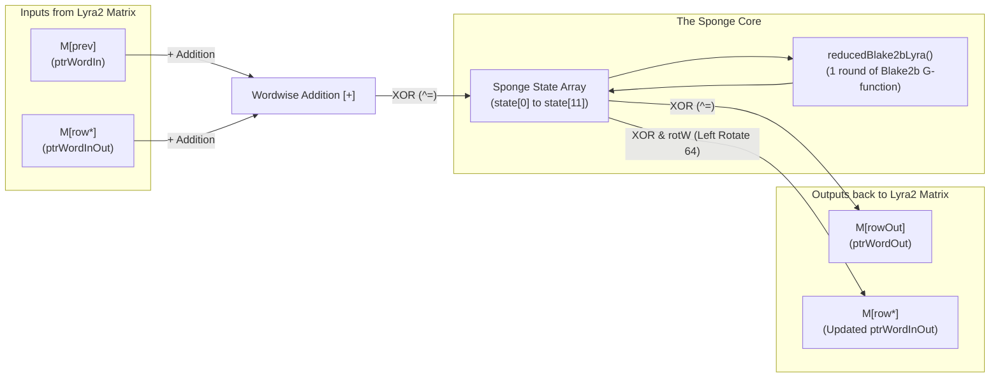

# Instructions

Build in Ubuntu 24.04 LTS:

```console
chmod +x build.sh
./build.sh
```

If error just read the feedback and install the missing packages. Other than that, there are large language model (LLM) artificial intelligence (AI) services you can ask. The prebuilts are the .wasm and .js files if you do not want to build yourselves.

# Diagrams

## build.sh



## bridge.cpp



## Lyra



## Sponge

### The Sponge State Lifecycle



### The Memory-Hard Duplex Operation (reducedDuplexRow)

