# Diagrams Explaining Codes

## Flowchart Outline

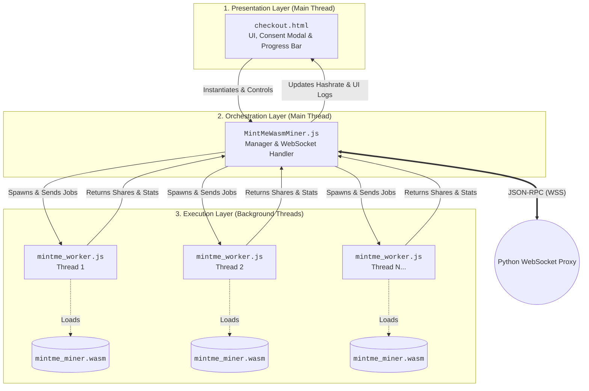

## Class Diagram
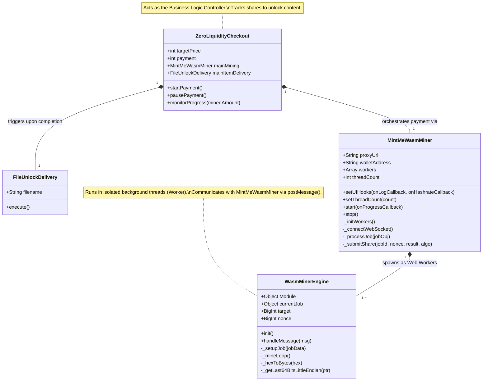

## checkout.html

### UI State Machine
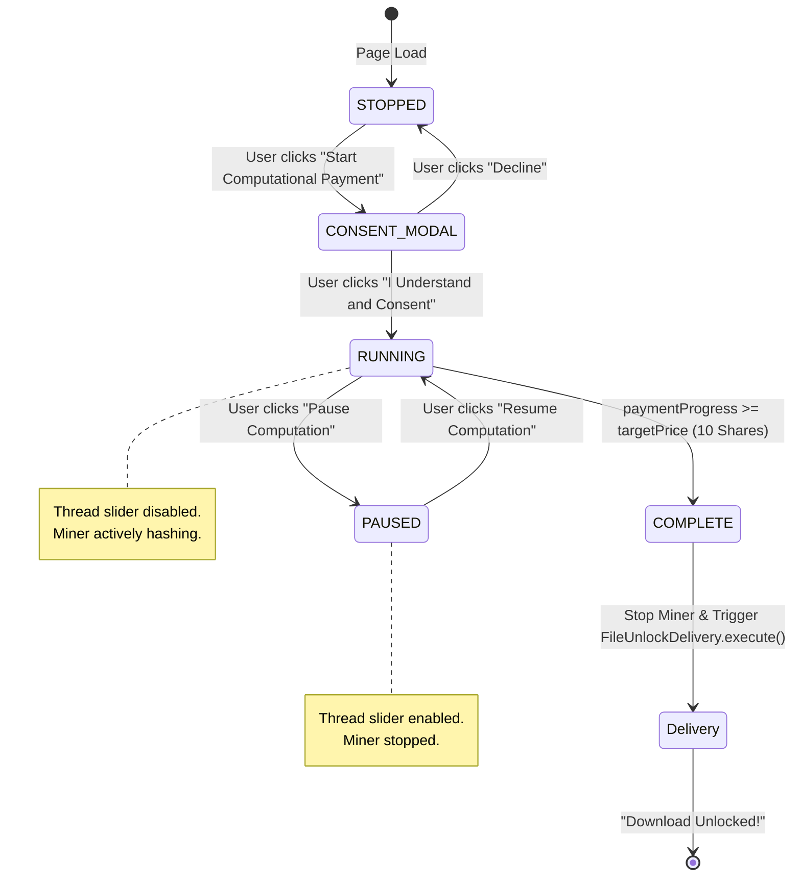

### DOM-to-Logic Flowchart

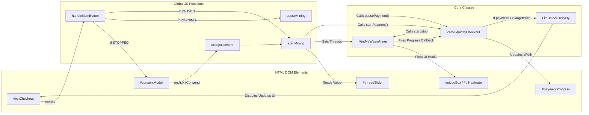

## mintme_worker.js

### Worker Execution Loop
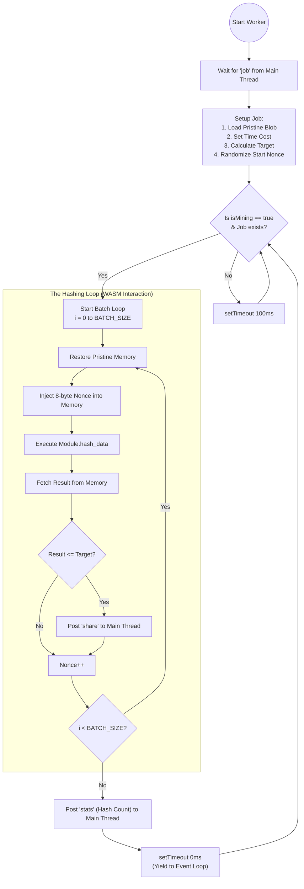

### Class Diagram
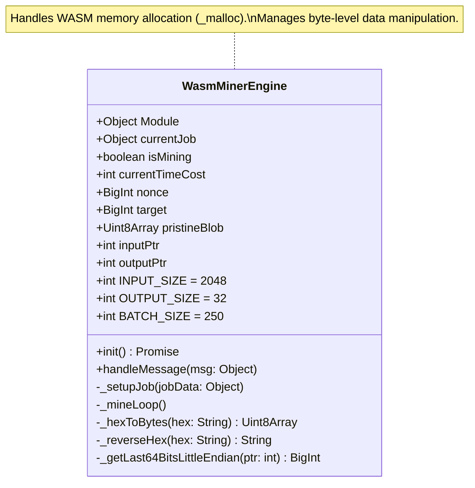

### Multi-threaded Sequence Diagram

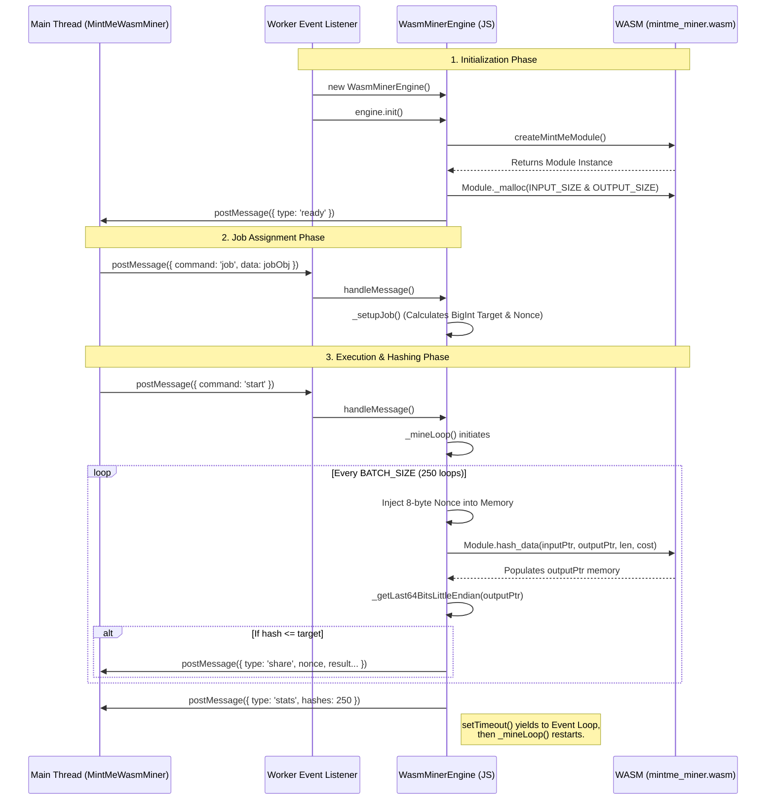

## MintMeWasmMiner.js

### Class Diagram

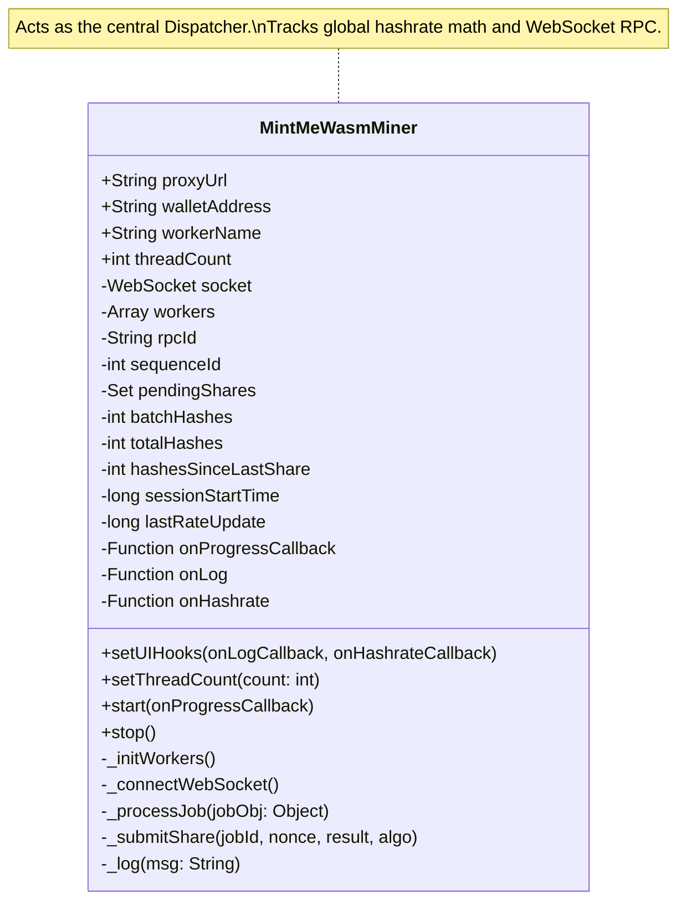

### Orchestration Sequence Diagram

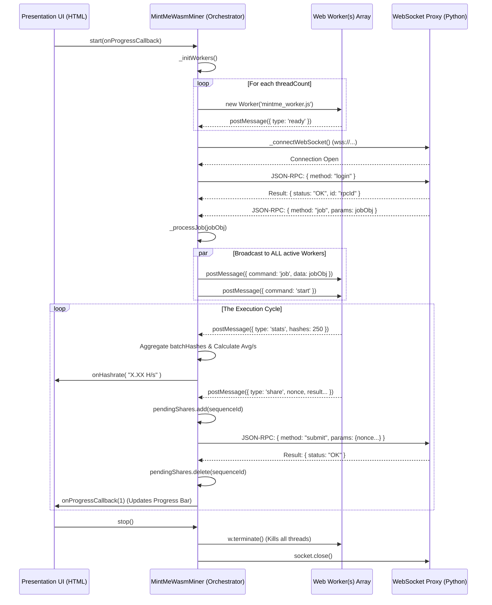

## mintme_miner.js

### The Emscripten Bootstrapping Lifecycle

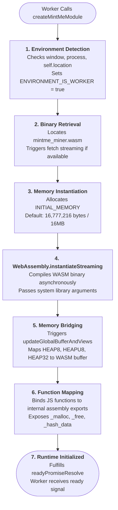

### The Shared Memory Bridge Architecture

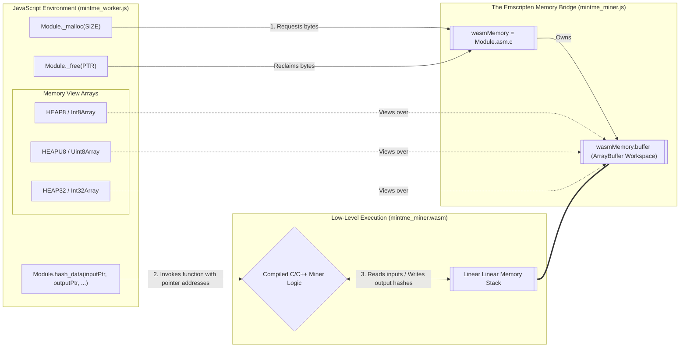