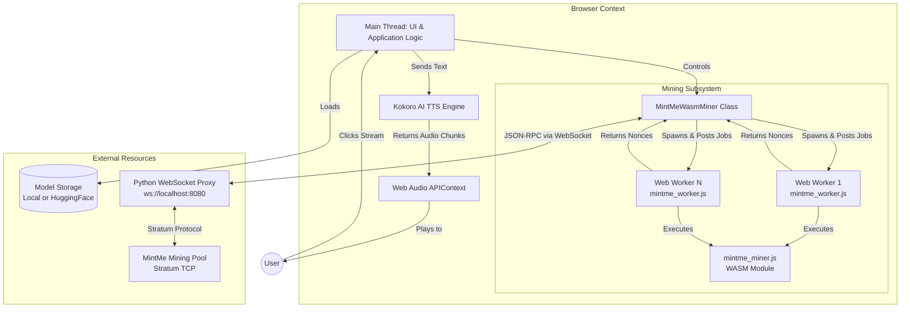
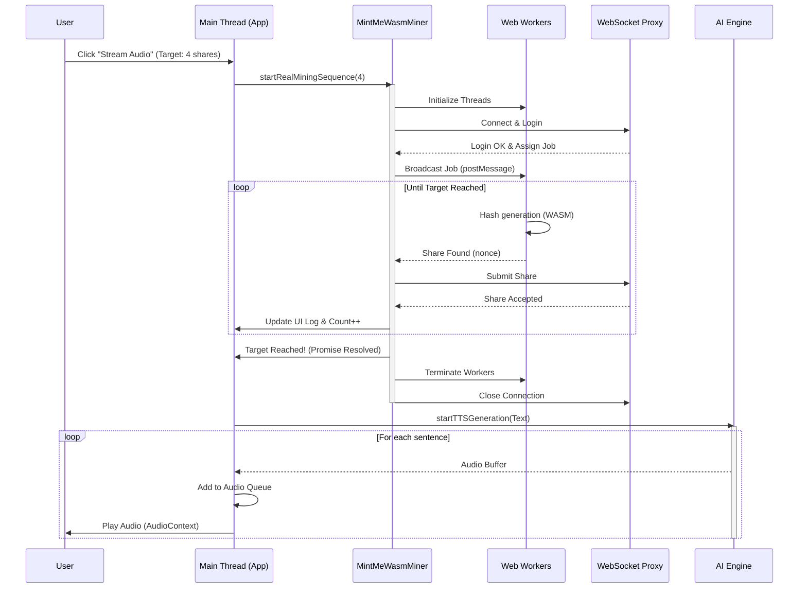
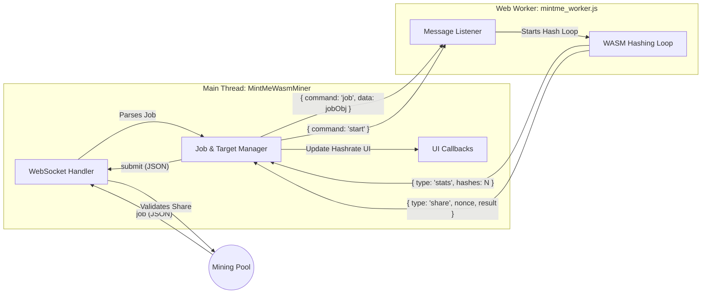

# Other Technicals

To run local, clone [Kokoro-82M-v1.0-ONNX](https://www.google.com/search?q=Kokoro-82M-v1.0-ONNX&sxsrf=APpeQntxE-zIuBdwjKSE7Z0uceep8v0SpQ%3A1787622787314).

# Diagrams Explaining Codes

## High-Level System Architecture

This flowchart maps out how the different components (Browser Main Thread, Web Workers, AI Engine, and External Networks) connect and communicate with each other.

## The Execution Pipeline (Sequence Diagram)
This sequence diagram explains the exact timeline of events when a user clicks the "Stream Audio" button. It shows how the promise-based mining process gates the AI generation.

## Miner Internal Data Flow

This diagram breaks down the specific messaging protocol used inside the MintMeWasmMiner class between the browser's Main Thread and the background Web Workers.

