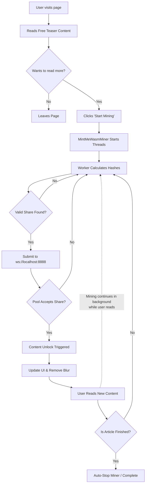
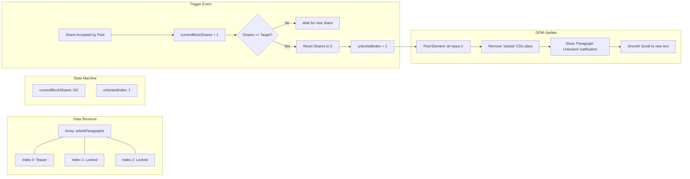
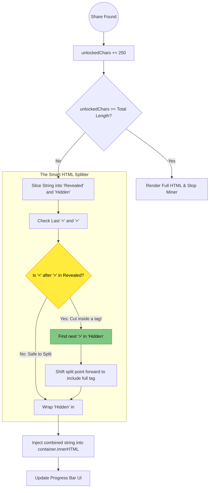

# Diagrams Explaining Codes

## The Pay-As-You-Read Core Loop
This diagram shows the continuous cycle of user experience and background computation. The beauty of this model is that Step 4 and Step 5 happen simultaneously.

## Paragraph-Based Unlock Logic
This diagram visualizes how the first version of our script handled data. It relies on mapping an array of text blocks to specific DOM elements.

## Character-Based Unlock Logic (with HTML Failsafe)
This diagram explains the highly versatile second version. It treats the entire article as one massive string and uses mathematical indices to slice it, complete with the failsafe to prevent breaking HTML tags.

