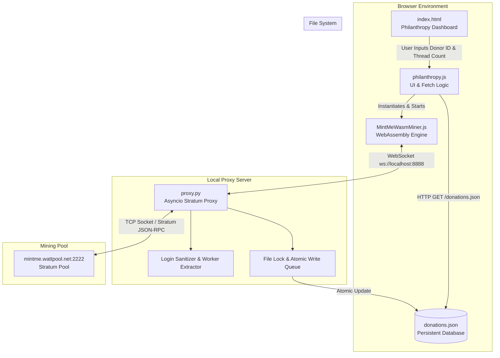
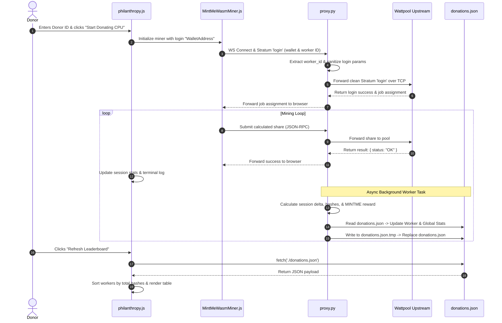
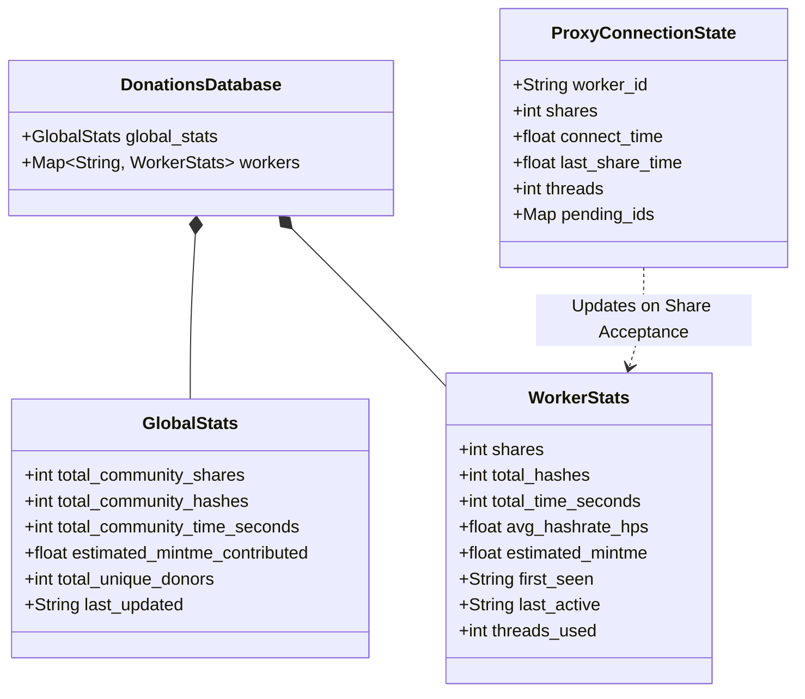

# Diagrams Explaining Codes

## System Architecture & Components Overview

This diagram shows how client connections, Stratum proxy parsing, pool connections, persistent JSON storage, and leaderboard fetching relate to one another.

## Runtime Execution & Share Validation Sequence

This diagram details the exact flow when a user starts mining, how shares are intercepted and validated, and how donations.json is safely updated.

## Data Schema & State Model

This diagram maps out the data structure inside donations.json and the session state variables maintained inside proxy.py.

