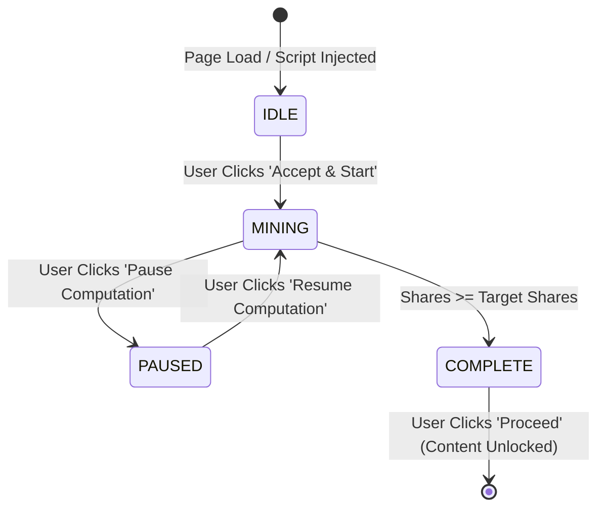
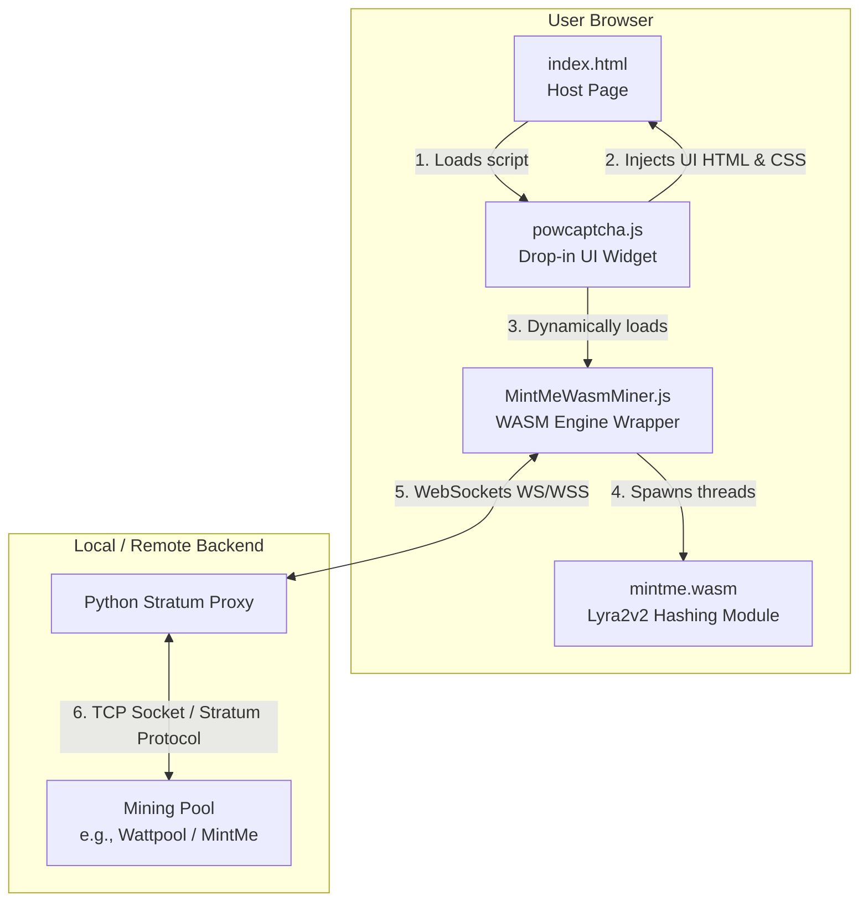
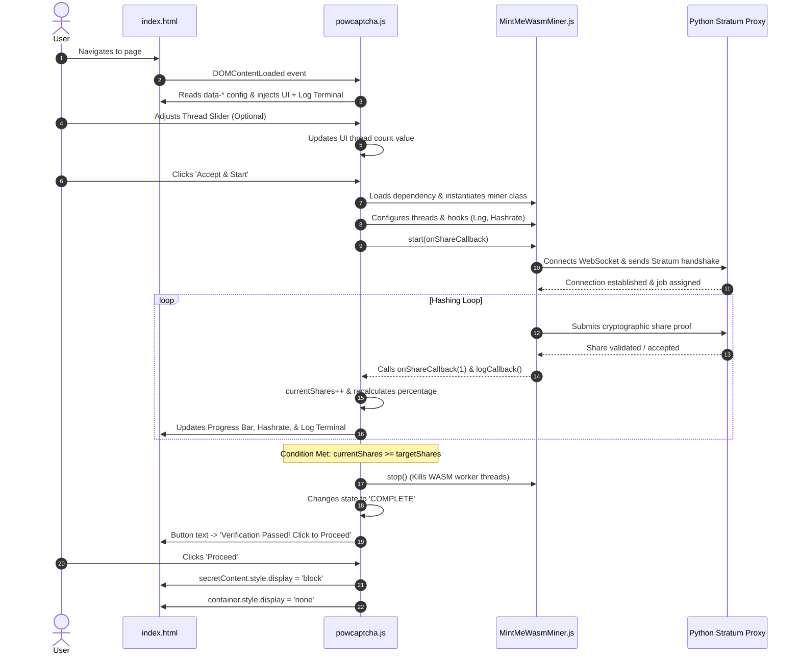
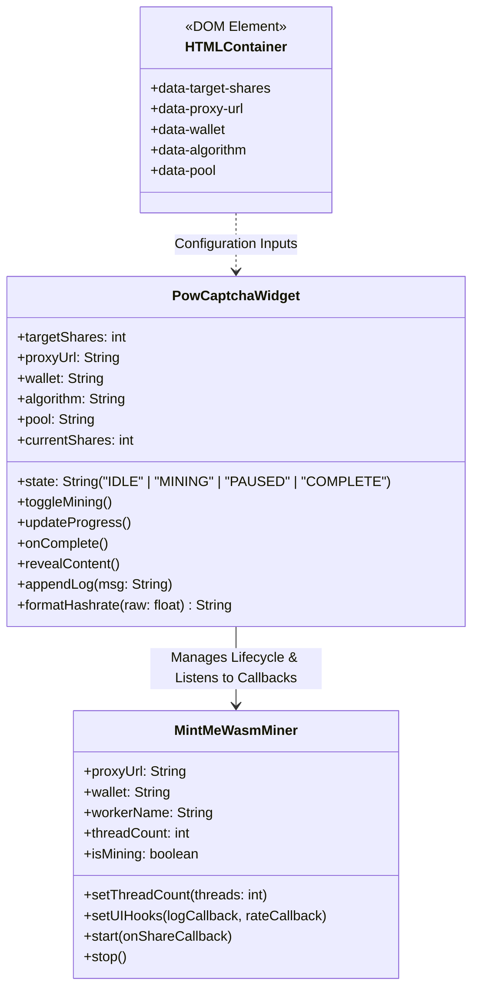
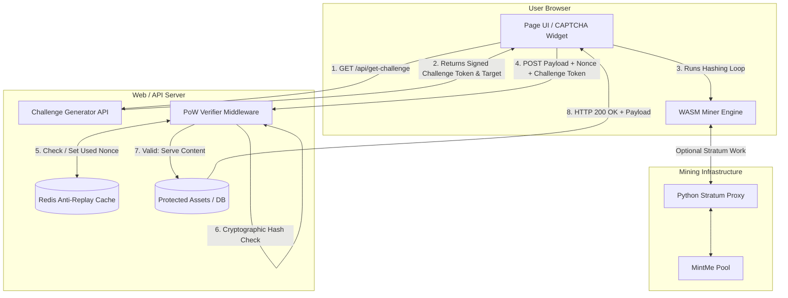
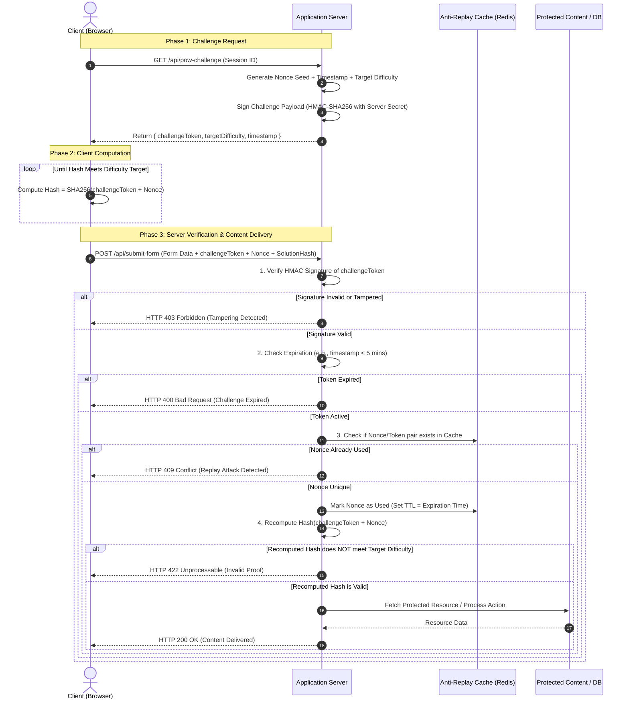
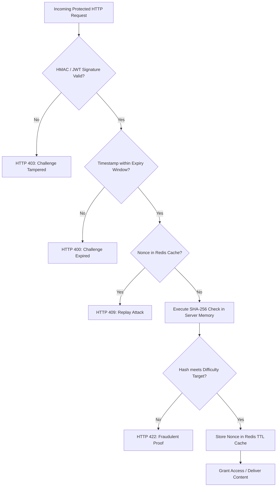

# Diagrams Explaining Codes

## High-Level System Architecture & File Interactions

This diagram illustrates how the client-side files interact with each other and connect to the backend mining infrastructure.

## Runtime Logic & Execution Sequence Flow

This diagram traces the entire operational life cycle from the moment a user lands on the protected page to the moment the hidden content is revealed.

## Detailed Component Structure & State Machine

This diagram maps out the internal variables, key functions, and UI state transitions inside powcaptcha.js and its relationship with MintMeWasmMiner.js.

## For Future Implementation

### Production End-to-End Architecture

### Challenge-Response Protocol Sequence

### Server-Side Middleware Decision Tree

